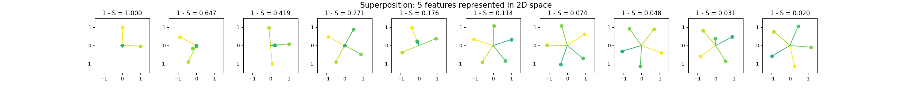

# TMS

Codebase for quickly implementing experiments with toy models of superposition. 

## Quickstart

To set up the environment, see [setup docs](docs/setup.md) for detailed instructions. 

To reproduce figures from Anthropic's [Toy Models of Superposition](https://transformer-circuits.pub/2022/toy_model/index.html), see [sample script](experiments/bottleneck_tms/run.py) 

## Acknowledgements

This codebase is heavily adapted from the [ARENA 3.0 codebase](https://github.com/callummcdougall/ARENA_3.0/tree/main), designed and maintained by Callum McDougall. Many thanks to Callum and the ARENA team!